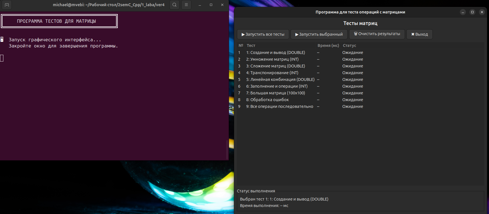
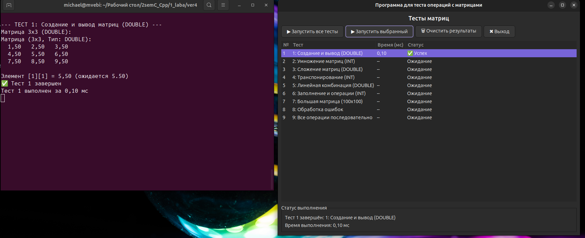
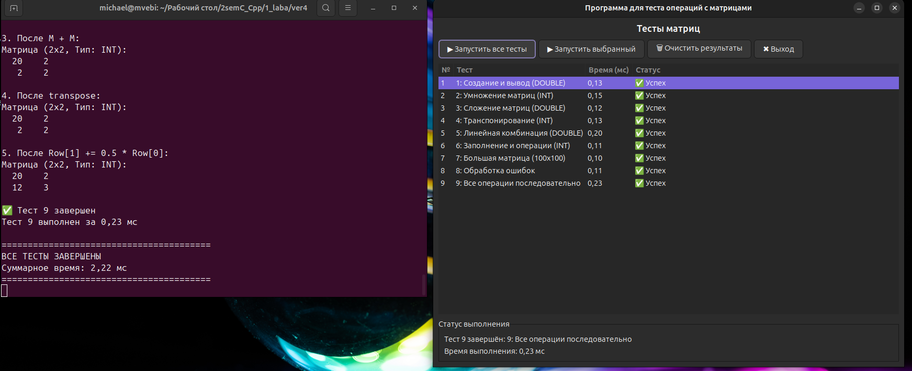

# Собрать всё (консоль + GUI + тесты + бенчмарки)
make all
# Собрать только консольную версию
make console
# Собрать только GUI
make gui
# Собрать только edge-тесты
make edge-tests
# Собрать только бенчмарки
make benchmark
# Очистить сборку
make clean
